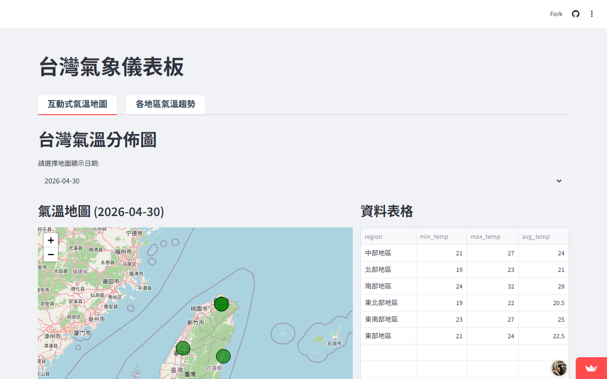

# AIoT HW2 - 台灣氣象儀表板 (Taiwan Weather Dashboard)

這是一個基於 Streamlit 開發的台灣即時氣象儀表板。專案會自動從中央氣象署抓取最新的氣溫與天氣資料，並以極簡且現代化的介面呈現給使用者。

## 🌟 功能特色
- **即時天氣獲取**：自動在背景從氣象局 API 抓取資料，並具有快取機制以提升效能。
- **互動式氣溫地圖**：結合 Folium 地圖，透過不同顏色直觀呈現台灣各縣市的氣溫分佈。
- **各地區氣溫趨勢**：使用 Plotly 繪製精美的互動式折線圖，查看一週內的最高/最低溫度趨勢。
- **極簡美學設計**：採用淺灰色背景與白底卡片的乾淨 UI，提供絕佳的使用者體驗。

## 🚀 Live Demo
點擊這裡查看線上展示：[**Live Demo 網址**](https://aiothw2-v6gezgj3ijtkwyceddvrsm.streamlit.app/)

## 📸 網頁截圖

## 📝 Development Log

### 第一階段：基礎架構與 API 串接
- **專案初始化**：建立 `app.py`, `fetch_weather.py`, `utils.py` 等專案核心結構。
- **CWA API 整合**：串接中央氣象署 API (F-A0010-001)，處理 JSON 解析與 SSL 驗證，成功獲取全台各縣市氣溫預報。

### 第二階段：資料儲存與處理 (HW2-3)
- **多格式儲存**：實作資料處理邏輯，計算平均氣溫，並將結果同步儲存至 CSV 檔案與 SQLite3 資料庫 (`data.db`)。
- **資料完整性**：確保每次執行 `fetch_weather.py` 皆能正確更新資料表，並透過查詢指令驗證資料寫入。

### 第三階段：儀表板開發與地圖視覺化 (HW2-4)
- **地圖視覺化**：利用 `folium` 根據各縣市平均氣溫動態標註顏色，直觀呈現台灣氣溫分佈。
- **互動式功能**：實作 Streamlit 分頁 (Tabs) 介面、地區下拉式選單與趨勢圖表，整合 SQLite 資料庫讀取功能。

### 第四階段：UI/UX 優化與自動化升級 (今日)
- **自動化抓取**：移除手動按鈕，改用 `@st.cache_data` 實作背景自動定期更新與快取機制。
- **介面大翻新**：導入極簡亮色系設計、自訂 CSS 卡片陰影、淺灰色背景，並將圖表升級為 Plotly 互動式折線圖。
- **佈署優化**：修復 Streamlit Cloud 環境路徑問題，並調整排版為 `centered` 模式，提升裝置相容性與美觀度。